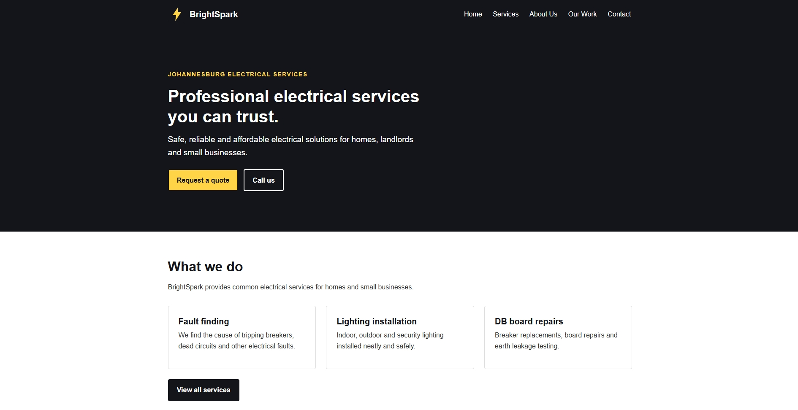
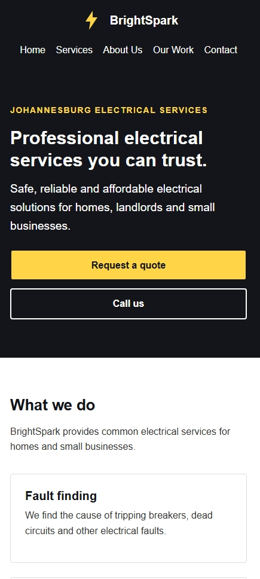
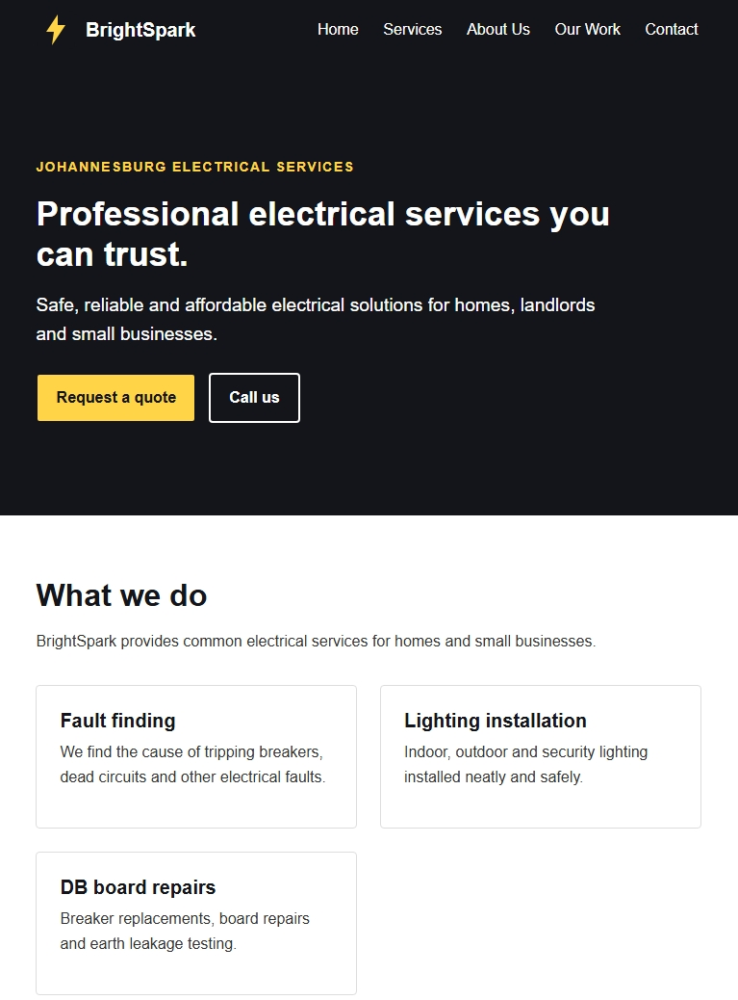

# BrightSpark Electrical Services - WEDE5020

**Student:** Keagile Makhafola  
**Student number:** ST10506576

## Website

BrightSpark Electrical Services is a five-page website for a fictional electrical company in Johannesburg.

The website includes:
- Home page
- Services page
- About Us page
- Our Work gallery
- Contact page with an enquiry form

## Technologies used

- HTML5
- CSS3
- Flexbox
- CSS Grid
- Media queries
- Responsive images using `srcset`, `sizes` and `picture`

## File structure

```text
index.html
services.html
about.html
gallery.html
contact.html
css/style.css
images/
README.md
```

## Responsive design

The website uses desktop, tablet and mobile layouts. The navigation, cards, images, forms and two-column sections change layout at smaller screen sizes.

## Testing

The website should be tested using browser developer tools at desktop, tablet and mobile sizes. Screenshots of the tests can be added here as evidence for the Test and Iterate section of the POE.


